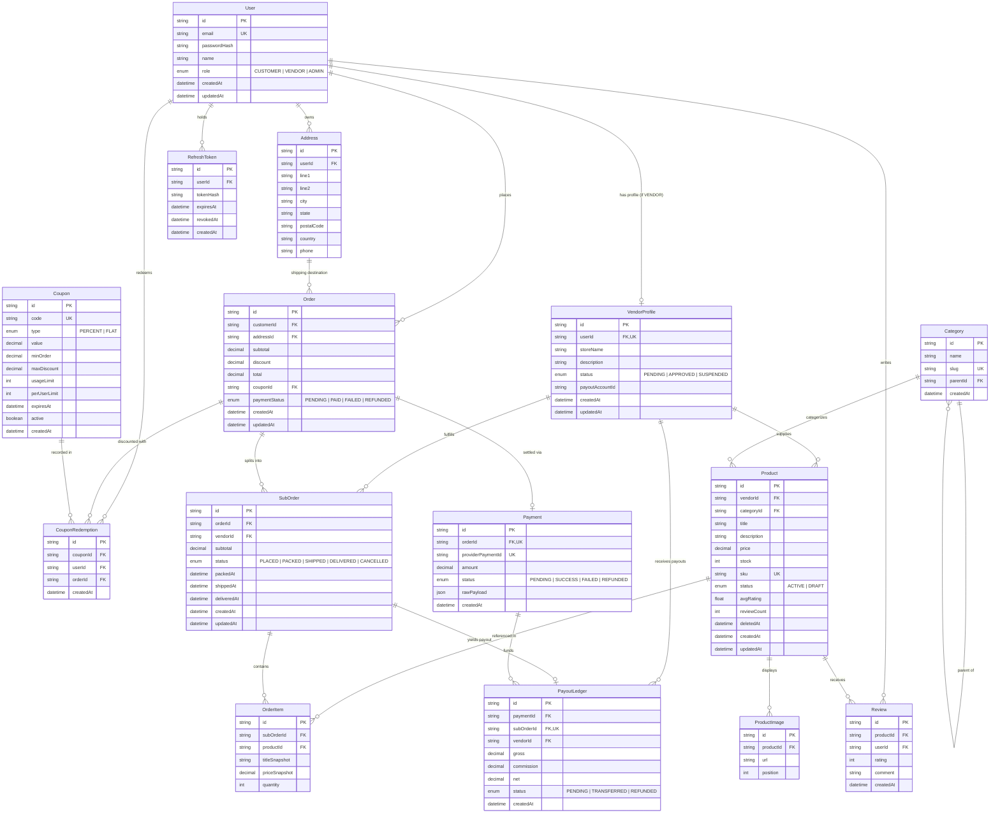

# Entity Relationship Diagram (ERD) - FS-01

```mermaid
erDiagram
    User ||--o| VendorProfile : "has profile (if VENDOR)"
    User ||--o{ Address : "owns"
    User ||--o{ Order : "places"
    User ||--o{ Review : "writes"
    User ||--o{ RefreshToken : "holds"
    User ||--o{ CouponRedemption : "redeems"

    VendorProfile ||--o{ Product : "supplies"
    VendorProfile ||--o{ SubOrder : "fulfills"
    VendorProfile ||--o{ PayoutLedger : "receives payouts"

    Category ||--o{ Product : "categorizes"
    Category ||--o{ Category : "parent of"

    Product ||--o{ ProductImage : "displays"
    Product ||--o{ OrderItem : "referenced in"
    Product ||--o{ Review : "receives"

    Address ||--o{ Order : "shipping destination"

    Order ||--o{ SubOrder : "splits into"
    Order ||--o| Payment : "settled via"
    Order ||--o{ CouponRedemption : "discounted with"

    SubOrder ||--o{ OrderItem : "contains"
    SubOrder ||--o| PayoutLedger : "yields payout"

    Payment ||--o{ PayoutLedger : "funds"
    Coupon ||--o{ CouponRedemption : "recorded in"

    User {
        string id PK
        string email UK
        string passwordHash
        string name
        enum role "CUSTOMER | VENDOR | ADMIN"
        datetime createdAt
        datetime updatedAt
    }

    VendorProfile {
        string id PK
        string userId FK, UK
        string storeName
        string description
        enum status "PENDING | APPROVED | SUSPENDED"
        string payoutAccountId
        datetime createdAt
        datetime updatedAt
    }

    Category {
        string id PK
        string name
        string slug UK
        string parentId FK
        datetime createdAt
    }

    Product {
        string id PK
        string vendorId FK
        string categoryId FK
        string title
        string description
        decimal price
        int stock
        string sku UK
        enum status "ACTIVE | DRAFT"
        float avgRating
        int reviewCount
        datetime deletedAt
        datetime createdAt
        datetime updatedAt
    }

    ProductImage {
        string id PK
        string productId FK
        string url
        int position
    }

    Address {
        string id PK
        string userId FK
        string line1
        string line2
        string city
        string state
        string postalCode
        string country
        string phone
    }

    Order {
        string id PK
        string customerId FK
        string addressId FK
        decimal subtotal
        decimal discount
        decimal total
        string couponId FK
        enum paymentStatus "PENDING | PAID | FAILED | REFUNDED"
        datetime createdAt
        datetime updatedAt
    }

    SubOrder {
        string id PK
        string orderId FK
        string vendorId FK
        decimal subtotal
        enum status "PLACED | PACKED | SHIPPED | DELIVERED | CANCELLED"
        datetime packedAt
        datetime shippedAt
        datetime deliveredAt
        datetime createdAt
        datetime updatedAt
    }

    OrderItem {
        string id PK
        string subOrderId FK
        string productId FK
        string titleSnapshot
        decimal priceSnapshot
        int quantity
    }

    Payment {
        string id PK
        string orderId FK, UK
        string providerPaymentId UK
        decimal amount
        enum status "PENDING | SUCCESS | FAILED | REFUNDED"
        json rawPayload
        datetime createdAt
    }

    PayoutLedger {
        string id PK
        string paymentId FK
        string subOrderId FK, UK
        string vendorId FK
        decimal gross
        decimal commission
        decimal net
        enum status "PENDING | TRANSFERRED | REFUNDED"
        datetime createdAt
    }

    Review {
        string id PK
        string productId FK
        string userId FK
        int rating
        string comment
        datetime createdAt
    }

    Coupon {
        string id PK
        string code UK
        enum type "PERCENT | FLAT"
        decimal value
        decimal minOrder
        decimal maxDiscount
        int usageLimit
        int perUserLimit
        datetime expiresAt
        boolean active
        datetime createdAt
    }

    CouponRedemption {
        string id PK
        string couponId FK
        string userId FK
        string orderId FK
        datetime createdAt
    }

    RefreshToken {
        string id PK
        string userId FK
        string tokenHash
        datetime expiresAt
        datetime revokedAt
        datetime createdAt
    }
```
